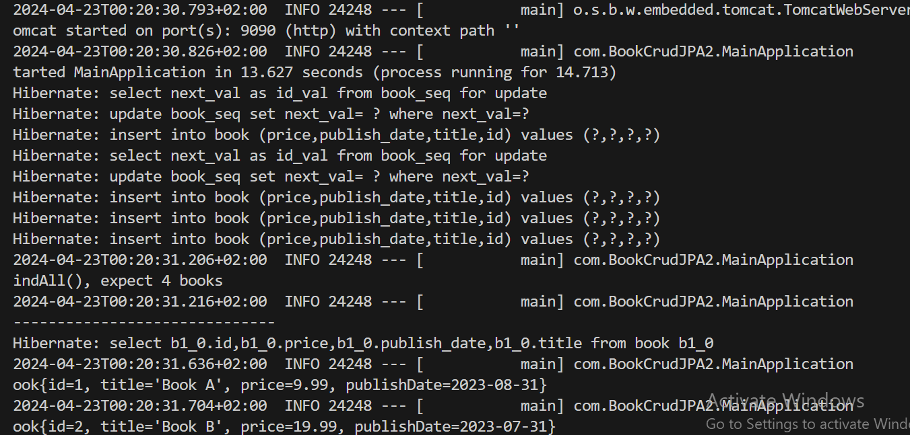

# Spring Boot + Spring Data JPA example

This is the source code for [Spring Boot + Spring Data JPA example]( https://github.com/eminegurra/BookCrudJPA2.git/)

## Technologies used:
* Spring Boot 3.1.2
* Spring Data JPA (Hibernate 6  is the default JPA implementation)
* H2 in-memory database
* Maven
* Java 17
* JUnit 5

## How to run it
```
$ git clone https://github.com/eminegurra/BookCrudJPA2.git

$ cd BookCrudJPA2

$ ./mvnw spring-boot:run
```




